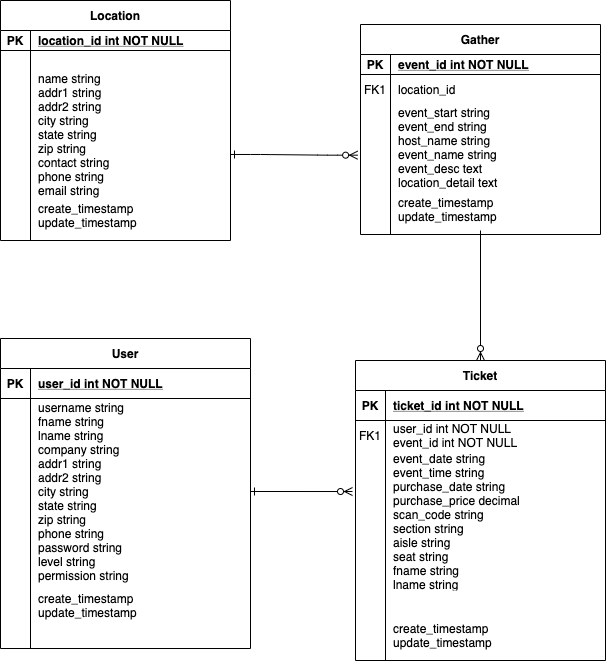

# DESIGN

## Client

Frontend - React
 
Frontend Deployment - Netlify
 

### Client Directory

  

### Component Heirarchy

  

### Component Breakdown

| Component      | Type       | State | Props | Description                                                                                            |
| -------------- | ---------- | ----- | ----- | ------------------------------------------------------------------------------------------------------ |
|                                                    |

## Server

Back End: The Server will be developed using Rails

### ERD Model

### Data Heirarchy

#### API Endpoints:

./Home/
 
./Home/auth/login
 
./Home/verify
 
./Home/tickets/:id

### Dependencies

| Library          | Purpose           |
| -----------------| ----------------- |
| React            | Render Front End  |
| React Router     | Link and Route    |
| axios            | API calls         |
| node-sass        | CSS               |
| react-router-dom | router            |
| react-scripts    | Smooth transition |
| CORS             | Render Front End  |
| Rails            | Back End Server   |